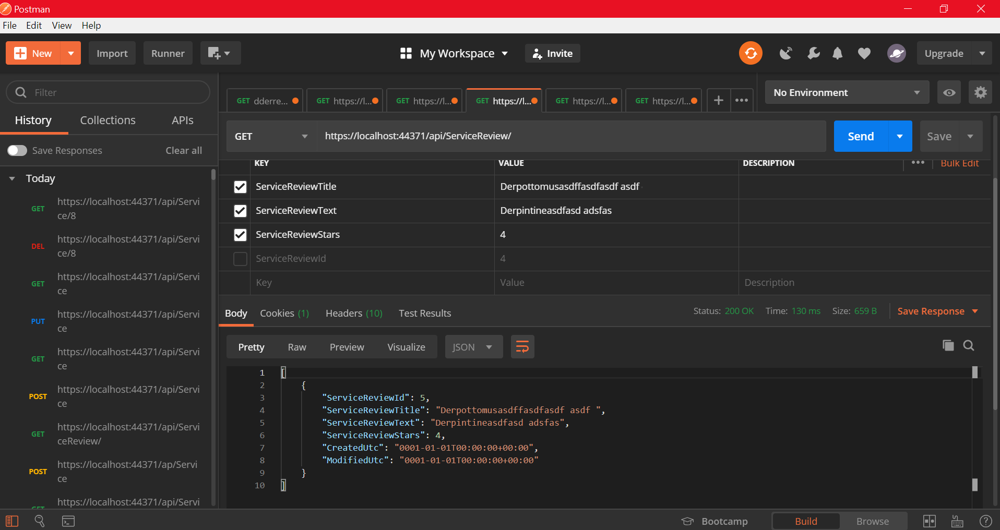
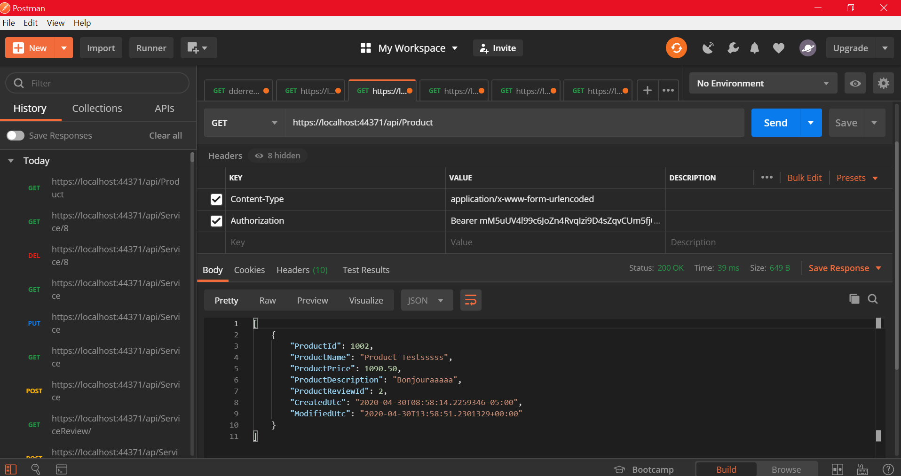
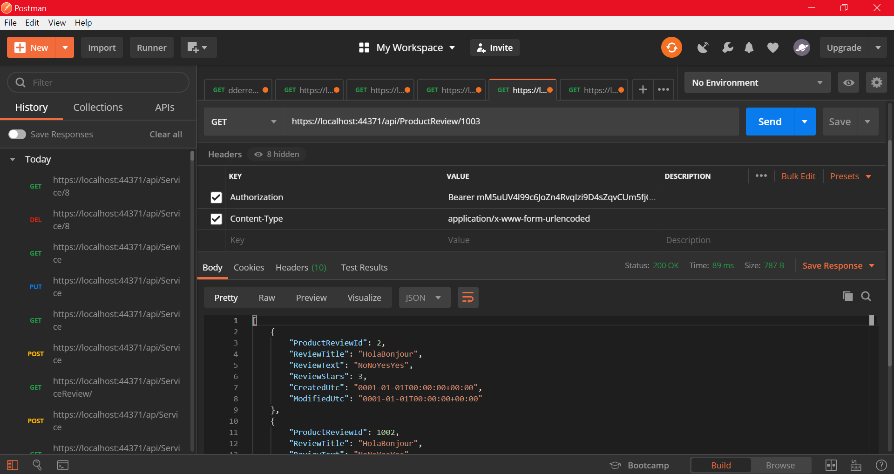

# Over 9000 Parts Computer Store
> This is a Web API with n-tier format showcasing how an online computer store may structure their backend.

## Table of contents
* [General info](#general-info)
* [Screenshots](#screenshots)
* [Technologies](#technologies)
* [Code Examples](#code-examples)
* [Features](#features)
* [Status](#status)
* [Inspiration](#inspiration)
* [Contact](#contact)

## General info
This project is for our Blue Badge with Eleven Fifty Academy. The Web API is based off of a Online Computer Store.

## Screenshots
Successful Postman Attempt 1:

Successful Postman Attempt 2:

Successful Postman Attempt 3:

## Technologies
* Visual Studio Community - Version 16.5.4

## Code Examples
Code Example 1:

Code Example 2:

## Features
List of features ready and TODOs for future development
* Add/Remove Products and Services
* Rate with Stars 1-5 about any Products and Services
* Create and Read Reviews of any Products and Services

To-do list:
* Create Front-End to be utilized with project.
* Shopping Cart

## Status
Project is: _finished_, with updates coming in the future.

## Inspiration
Project inspired by _Eleven Fifty Academy_ and _Dragon Ball Z_, based on a standard Web API.

## Contact
Created by Kevin Moore (kevinmoore.tech@gmail.com), Garen Bragg (garen.t.bragg@gmail.com), Carson Blair (cbcarcar@gmail.com).